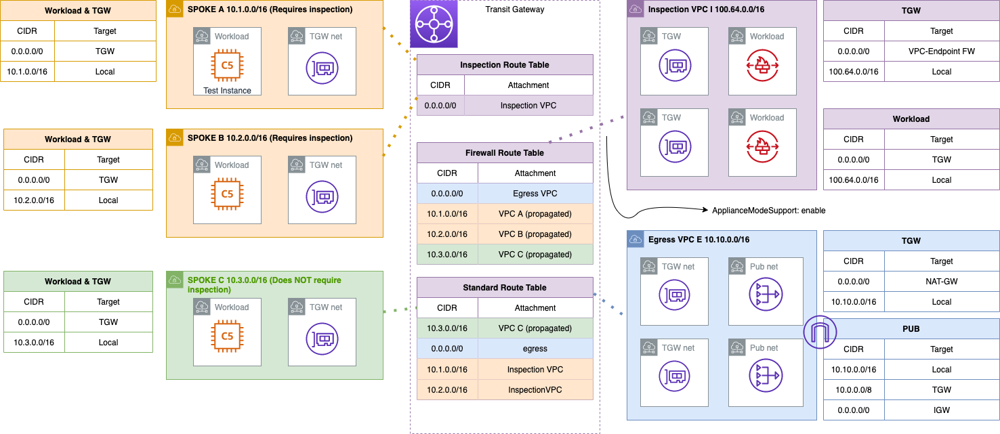

# aws-cdk-complex-network-example

Example of multiple VPC's connected via Transit Gateway. In this example we differentiate 2 types of consumer VPC's

- StandardCloudConsumerVpc (Green)
  - A standard VPC can reach the internet via the `egress` VPC.
- InspectedCloudConsumerVpc (Orange)
  - An inspected VPC can reach the internet and other VPC's ONLY by traversing the Inspection VPC first.

All VPC's come equipped with: 
- SSM VPC Interface Endpoints for shell access via session manager. 
- VPC Flow Logs
- 2 AZ's that have:
  - Workload subnets,
  - TGW Subnets,
- VPC's do NOT have public subnets by default. 

## Architecture

Looks like this: 



## Test Instance Construct

The `test_instance` construct creates an Amazon Linux 2 based EC2 instance that you can use to test network connectivity between VPC's and the internet. Security Group allows only ICMP by default. The

Example usage:

```ts
new TestInstance(this, 'a', { vpc: vpc, subnetGroupName: 'workload' });
```

